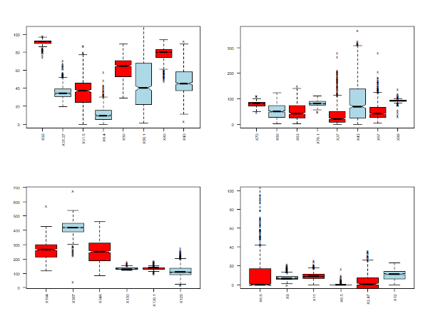
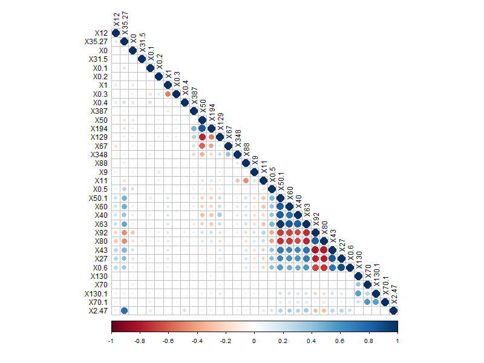
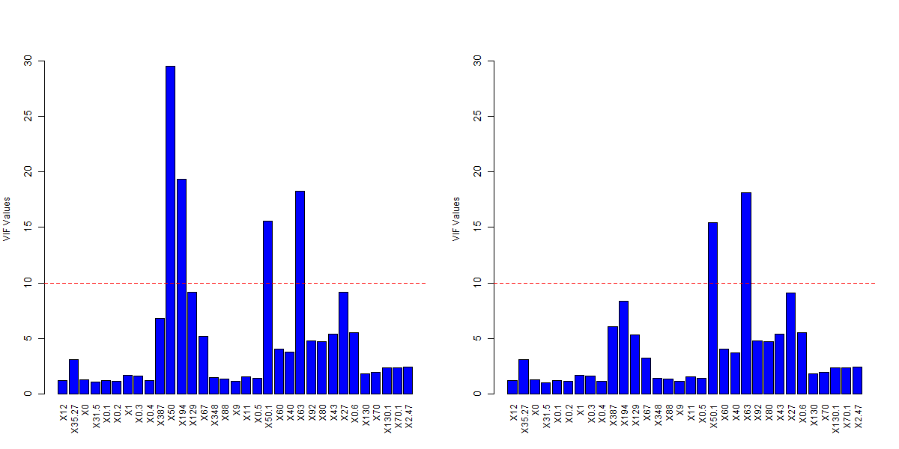
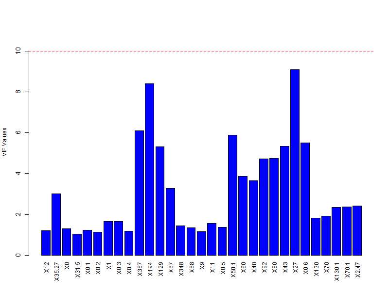

# Subsampling Based Model Selection for Linear Predictive Models 

This repository contains the methodology and implementation of my undergraduate thesis, conducted at the University of Crete, Department of Applied Mathematics.

## 📌 Project Overview
The primary objective of this thesis is to evaluate a **Subsampling-based model selection approach** for Linear Regression models. The study utilizes a clinical dataset from the **Department of Respiratory Medicine (School of Medicine, University of Crete)** to identify key factors influencing health outcomes in patients undergoing specific therapies. To ensure data confidentiality, variables have been assigned with coded names.

## 🛠️ Technical Pipeline
The research follows a comprehensive statistical workflow:

### 1. Exploratory Data Analysis (EDA)
* Detailed inspection of 33 predictors using **Boxplots** to identify distributions and outliers.
* Analysis of inter-relationships through **Correlation Matrices**.
  

Boxplots for each predictor (excluded the binary predictors).

Initial correlation analysis showing dependencies between predictors.

### 2. Feature Selection & Regularization
* **Multicollinearity Treatment:** Applied **Variance Inflation Factor (VIF)** analysis. Predictors **X50** and **X63** were removed for exceeding the threshold (VIF > 10).
* **Lasso-type Estimators:** Implementation of four regularization methods to induce sparsity:
    * **Lasso** & **Adaptive Lasso** ($L_2$ methods).
    * **LAD Lasso** & **Adaptive LAD Lasso** ($L_1$ methods).

VIF values before and after filtering problematic predictors.

### 3. Resampling Techniques
* **Subsampling:** Drawing unique subsamples without replacement, using a size of $m = \lfloor 0.632n \rfloor$.
* **Bootstrap:** Generated 200 pseudo-data resamples with replacement to construct robust **Confidence Intervals**.

### 4. Model Validation
* **Cross-Validation:** Performed **10-Fold CV** repeated 100 times to ensure stable error estimates.
* **Metrics:** Evaluation based on **Root Mean Squared Error (RMSE)** for $L_2$ models and **Mean Absolute Error (MAE)** for $L_1$ models.

## 📈 Key Findings
* **Predictor Stability:** Variable **X12** emerged as the most consistently significant predictor across all four methodologies.
* **Method Performance:** While $L_1$ methods were theoretically considered for healthcare data, the results indicated that **$L_2$ methods (Lasso/ADLASSO)** performed better in this specific case.
* **Inference:** Bootstrap sampling provided higher precision in estimates compared to conventional methods.

## Libraries
* **Language:** R 
* **Key Packages:**
    * `glmnet`: Lasso and Ridge regularization.
    * `rqPen`: LAD Lasso and Adaptive LAD Lasso implementation.
    * `hqreg`: Quantile regression utilities.

